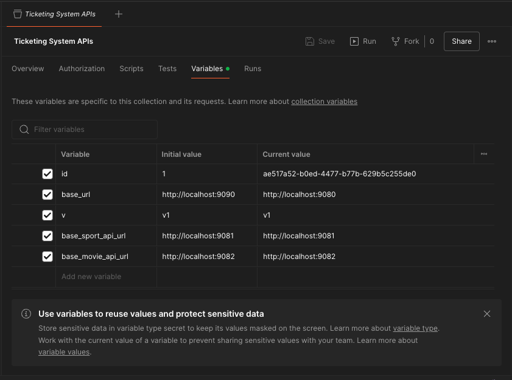
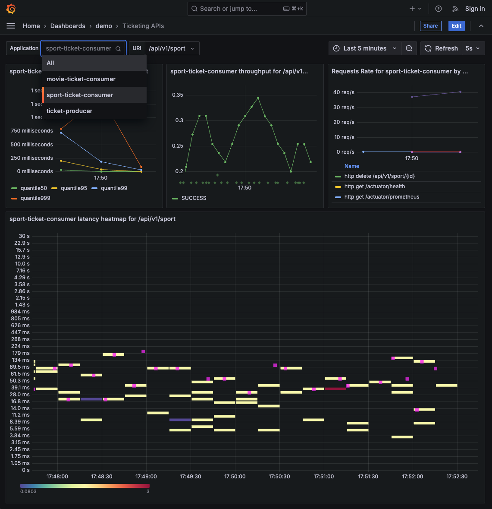

# SNS to SQS Fan-out with DynamoDB, Lambda, LocalStack, ELK, and Grafana

This project demonstrates an event-driven architecture where messages are sent to an SNS topic and "fan out" to multiple SQS queues. It ensures a fully decoupled approach with no data loss and the ability to scale by adding more SQS queues over time. Built as a Spring Boot multi-module application, it is fully containerized and runs in LocalStack, an AWS emulator that enables local development and testing, significantly reducing AWS development costs. 

Infrastructure build is done in the LocalStack [init ready hook](https://docs.localstack.cloud/references/init-hooks/)

## Features  

- **DynamoDB Streams**: Polls changes to DynamoDB tables.  
- **Lambda**: Processes DynamoDB stream events .  
- **SNS Notifications**: Publisher that sends notifications triggered by DynamoDB events to all subscribers.  
- **SQS Queue**: Subscriber that receives notifications and triggers consumer processing.  
- **LocalStack Integration**: Enables local development and testing of AWS services and saves you some money.
- **Rate Limited /api/ticket/ratelimited endpoint**: Spring Bootimplementation of rate limiting without additional dependencies.
- **Kibana & Grafana Visualization**
- **Open Telemetry**


## Pre-requisites
* [Java 21+](https://www.oracle.com/java/technologies/downloads/#java21) use [SDKMAN](https://sdkman.io/)
* [Maven](https://maven.apache.org/)
* [Docker](https://www.docker.com/get-started)

## Project Diagram


## Quickstart

- [Build](#build)
- [Run the project](#running-locally)
- [Run traffic](#running-traffic)
- [Kibana](#kibana)
- [Grafana](#grafana)
- [Postman](#postman)


## Build

1. For environment variables refer to [.env.example](.env.example)
    <details>
    <summary>Example .env.example</summary>
    <ul>
      <li>
        
        # Demo App version
        IMAGE_VERSION=1.0.0

        # Dependent images
        COLLECTOR_CONTRIB_IMAGE=ghcr.io/open-telemetry/opentelemetry-collector-releases/opentelemetry-collector-contrib:0.116.1
        JAEGERTRACING_IMAGE=jaegertracing/all-in-one:latest
        GRAFANA_IMAGE=grafana/grafana:11.4.0
        PROMETHEUS_IMAGE=quay.io/prometheus/prometheus:v2.48.0

        # LocalStack
        AWS_DEFAULT_REGION=us-east-1
        AWS_REGION=us-west-1
        AWS_ACCESS_KEY_ID=key
        AWS_SECRET_ACCESS_KEY=secret
        AWS_LAMBDA_EXEC_WRAPPER=/opt/otel-handler
        SERVICES=dynamodb,sns,sqs,lambda

        TICKET_PRODUCER_URL=http://ticket-producer:9080
        DEBUG=1


        # OpenTelemetry Collector
        HOST_FILESYSTEM=/
        DOCKER_SOCK=/var/run/docker.sock
        OTEL_COLLECTOR_HOST=otel-collector
        OTEL_COLLECTOR_PORT_GRPC=4317
        OTEL_COLLECTOR_PORT_HTTP=4318
        OTEL_COLLECTOR_CONFIG=./docker/otel-collector/otel-config.yaml
        OTEL_EXPORTER_OTLP_ENDPOINT=http://${OTEL_COLLECTOR_HOST}:${OTEL_COLLECTOR_PORT_GRPC}
        PUBLIC_OTEL_EXPORTER_OTLP_TRACES_ENDPOINT=http://localhost:8080/otlp-http/v1/traces

        # OpenTelemetry Resource Definitions
        OTEL_RESOURCE_ATTRIBUTES=service.namespace=ticketing-demo,service.version=${IMAGE_VERSION}

        # Metrics Temporality
        OTEL_EXPORTER_OTLP_METRICS_TEMPORALITY_PREFERENCE=cumulative

        # ******************
        # Core Demo Services
        # ******************
        # Ticket Producer Service
        TICKET_PRODUCER_PORT=9080
        TICKET_PRODUCER_RATE_LIMIT=5
        TICKET_PRODUCER_RATE_DURATIONINMS=10000

        # Sport Ticket Consumer Service
        SPORT_CONSUMER_PORT=9081

        # Movie Ticket Consumer Service
        MOVIE_CONSUMER_PORT=9082

        # ******************
        # ELK Stack
        # ******************
        # Version of Elastic products, previously used 7.17.25
        STACK_VERSION=8.16.1
        # Password for the 'elastic' user (at least 6 characters)
        ELASTIC_PASSWORD=r34lys3cur3
        # Password for the 'kibana_system' user (at least 6 characters)
        KIBANA_PASSWORD=r34lys3cur3
        # Set the cluster name
        CLUSTER_NAME=docker-cluster
        # Set to 'basic' or 'trial' to automatically start the 30-day trial
        LICENSE=basic
        # Port to expose Elasticsearch HTTP API to the host
        ES_PORT=9200
        # Port to expose Kibana to the host
        KIBANA_PORT=5601
        # Increase or decrease based on the available host memory (in bytes)
        MEM_LIMIT=1073741824
        # SAMPLE Predefined Key only to be used in POC environments
        ENCRYPTION_KEY='M60QN2cT30NHwwtGLJ3ERYJGFw8p9Q1MdSgerE79HT4='

        # HOST=localhost
        PORT=9080

        # ********************
        # Open Telemetry Components
        # ********************
        # Grafana
        GRAFANA_SERVICE_PORT=3000

        # Jaeger
        JAEGER_SERVICE_PORT=16686
        JAEGER_SERVICE_HOST=jaeger

        # Prometheus
        PROMETHEUS_SERVICE_PORT=9090
        PROMETHEUS_SERVICE_HOST=prometheus
        PROMETHEUS_CONFIG=./docker/prometheus/prometheus-config.yaml
        PROMETHEUS_ADDR=${PROMETHEUS_SERVICE_HOST}:${PROMETHEUS_SERVICE_PORT}
      </li>
    </ul>
    </details>
  <br>

2. Build [Maven](https://maven.apache.org/) project
    ```
    mvn clean install
    ```
3. Package lambda
    ```
    ./scripts/package-lambda-function.sh
    ```
4. Use buildpack OCI [Docker](https://docs.docker.com/desktop/) images
    ``` sh
    ./scripts/build-docker-images.sh
    ```

## Running Locally

### Docker Compose

Kickoff the entire project and run all services behind the [LocalStack DNS Server](https://blog.localstack.cloud/2024-03-04-making-connecting-to-localstack-easier/) 

```
docker compose up --build
```

## Running Traffic
``` sh 
./scripts/run-traffic.sh
  ```
## Postman
- Import [collection](./ticketing.postman_collection.json) into Postman
- Setup environment variables


## Kibana
http://localhost:5601


## Grafana
http://localhost:3000/




## Preview in Browser

| Application     | Type    | URL                                     |
|-----------------|---------|-----------------------------------------|
| `ticket-producer` | Swagger | http://localhost:9080/swagger-ui.html |
| `sport-ticket-consumer` | UI      | http://localhost:9081                  |
| `movie-ticket-consumer` | UI      | http://localhost:9082                  |

## Preview in H2 Console

| Application     | Type    | URL                                     |
|-----------------|---------|-----------------------------------------|
| `sport-ticket-consumer` | UI      | http://localhost:9081/h2-console               |
| `movie-ticket-consumer` | UI      | http://localhost:9082/h2-console                  |


## Shutdown

```
docker compose down -v --remove-orphans
```

## Cleanup

``` sh
./scripts/remove-docker-images.sh 
```
