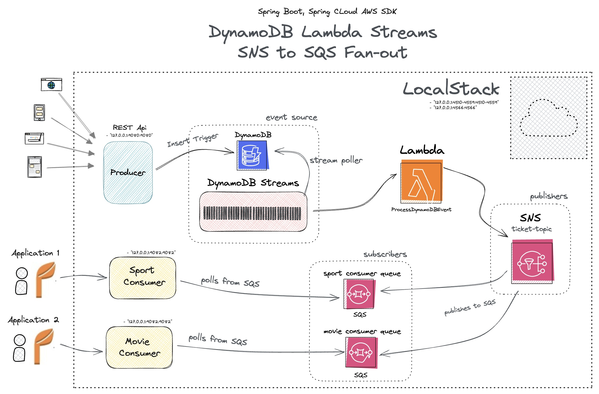

# Implementing SNS to SQS Fan-out with Filter Policies Using AWS LocalStack and ELK Stack

This project demonstrates event message sent to SNS topic then "Fan-out" to multiple SQS Queues. It is fully decoupled approach with no data losss and ability to scale more SQS Queus over time. Built as Spring Boot multi module application, fully dockerized, running in LocalStack. 

Infrastructure build is done in the LocalStack [init ready hook](https://docs.localstack.cloud/references/init-hooks/)

## Features  

- **DynamoDB Streams**: Polls changes to DynamoDB tables.  
- **AWS Lambda**: Processes DynamoDB stream events .  
- **SNS Notifications**: Publisher that sends notifications triggered by DynamoDB events to all subscribers.  
- **SQS Queue**: Subscriber that receives notifications and triggers consumer processing.  
- **LocalStack Integration**: Enables local development and testing of AWS services and saves you some money.  


## Pre-requisites
* [Java 21+](https://www.oracle.com/java/technologies/downloads/#java21)
* [Maven](https://maven.apache.org/)
* [AWS CLI](https://aws.amazon.com/cli/)
* [SAM CLI](https://github.com/awslabs/aws-sam-cli)

## Project Diagram


## Prepare Project


1. Build in [Maven](https://maven.apache.org/)

    ```
    mvn clean install
    ```

2. Package lambda

    ```
    ./package-lambda-function.sh
    ```


3. Build [Docker](https://docs.docker.com/desktop/) images

    ```
    ./docker-build.sh
    ```

4. Create .env with following entries. Note that LocalStack image accepts AWS_DEFAULT_REGION while Spring Cloud requires AWS_REGION

    ```
    # LocalStack related 
    AWS_REGION=us-west-1
    AWS_ACCESS_KEY_ID=key
    AWS_SECRET_ACCESS_KEY=secret
    SERVICES=dynamodb,sns,sqs,lambda
    TICKET_PRODUCER_URL=http://producer:9080
    DEBUG=1

    # ELK Stack related. Previously used 7.17.25, bumped to 8.16.1
    STACK_VERSION=

    # Password for the 'elastic' user (at least 6 characters)
    ELASTIC_PASSWORD=

    # Password for the 'kibana_system' user (at least 6 characters)
    KIBANA_PASSWORD=

    # Set the cluster name 'docker-cluster'
    CLUSTER_NAME=

    # Set to 'basic' or 'trial' to automatically start the 30-day trial
    LICENSE=

    # Port to expose Elasticsearch HTTP API to the host 9200
    ES_PORT=

    # Port to expose Kibana to the host 5601
    KIBANA_PORT=

    # Increase or decrease based on the available host memory (in bytes)
    MEM_LIMIT=

    # SAMPLE Predefined Key only to be used in POC environments
    ENCRYPTION_KEY=
    ```


# Running 

## Docker Compose

Kickoff the entire project and run all services behind the [LocalStack DNS Server](https://blog.localstack.cloud/2024-03-04-making-connecting-to-localstack-easier/) 

```
docker compose up --build
```


## Maven

- **ticket-producer**

  In a terminal and, inside `aws-localstack-spring-boot-dynamodb-lambda-sqs-sns` root folder, run the following command
  ```
  export AWS_REGION=eu-west-1 && export AWS_ACCESS_KEY_ID=key && export AWS_SECRET_ACCESS_KEY=secret && \
  ./mvnw clean spring-boot:run --projects ticket-producer
  ```

- **ticket-consumer**

  In another terminal and, inside `spring-boot-lambda-demo` root folder, run the command below
  ```
  export AWS_REGION=eu-west-1 && export AWS_ACCESS_KEY_ID=key && export AWS_SECRET_ACCESS_KEY=secret && \
    -e TICKET_PRODUCER_URL=http://ticket-producer:9080 \
    ./mvnw clean spring-boot:run --projects ticket-consumer
    ```

## Preview in Browser

| Application     | Type    | URL                                     |
|-----------------|---------|-----------------------------------------|
| `ticket-producer` | Swagger | http://localhost:9080/swagger-ui.html |
| `sport-consumer` | UI      | http://localhost:9081                  |
| `movie-consumer` | UI      | http://localhost:9082                  |

## Preview in H2 Console

| Application     | Type    | URL                                     |
|-----------------|---------|-----------------------------------------|
| `sport-consumer` | UI      | http://localhost:9081/h2-console               |
| `movie-consumer` | UI      | http://localhost:9082/h2-console                  |

## Playing around

- **Creating Events**

  - To create sport event in a terminal, run
    ```
    curl -i -X POST http://localhost:9080/api/ticket \
      -H 'Content-Type: application/json' \
      -d '{
        "title": "Las Vegas Knights - LA Kings @ Nov 21st, Allegiant Arena", \
        "eventType": "sport"
    }'
    ```
  - To create movie event in a terminal, run
    ```
    curl -i -X POST http://localhost:9080/api/ticket \
      -H 'Content-Type: application/json' \
      -d '{
        "title": "The Godfather @ Dec 31st AMC Fashion Valley San Diego CA", "eventType": "movie"
    }'
    ```

    or to create ticket events randomly
    ```
    curl -i -X POST http://localhost:9080/api/ticket/randomly
    ```

  - Open new browser window. In [sport-consumer UI](http://localhost:9081), only the sport events should be displayed.
  - Open new browser window. In [movie-consumer UI](http://localhost:9082), only the movie events should be displayed.

- **Have fun stressing it**

    ```
    for i in {1..100}; do
        curl --location 'http://localhost:9080/api/ticket' \
            --header 'Content-Type: application/json' \
            --header 'Connection: keep-alive'
    done
    ```

- **Deleting ticket events**

  - In a terminal, run the following command
    ```
    curl -i -X DELETE http://localhost:9080/api/ticket/<TICKET_ID>
    ```

  - In [sport-consumer UI](http://localhost:9081) and respoective [movie-consumer UI](http://localhost:9082), the events should be removed

## Shutdown

```
docker compose down -v --remove-orphans
```

## Cleanup

```
./remove-docker-images.sh 
```

## AWS Deployment

SAM template coming up